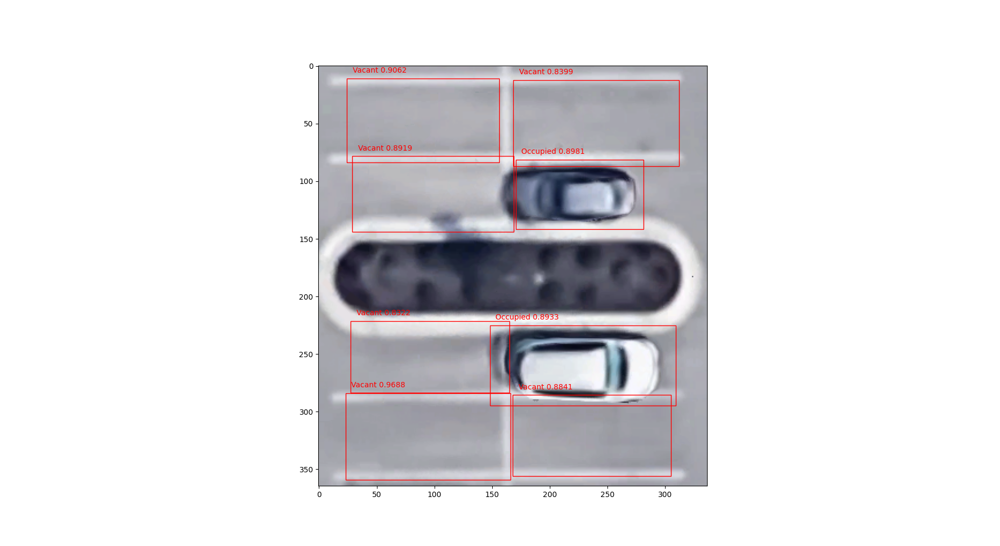

# Parking Spotter
PyTorch/Detecto program that identifies occupied and vacant parking spots.
[PyTorch Model](https://www.dropbox.com/s/nz8zn7z6c8dc5qg/ParkingSpotterModel.pt?dl=0)
This model can still be improved significantly, as you can see from the bad examples.

## Good Examples

## Bad Examples

